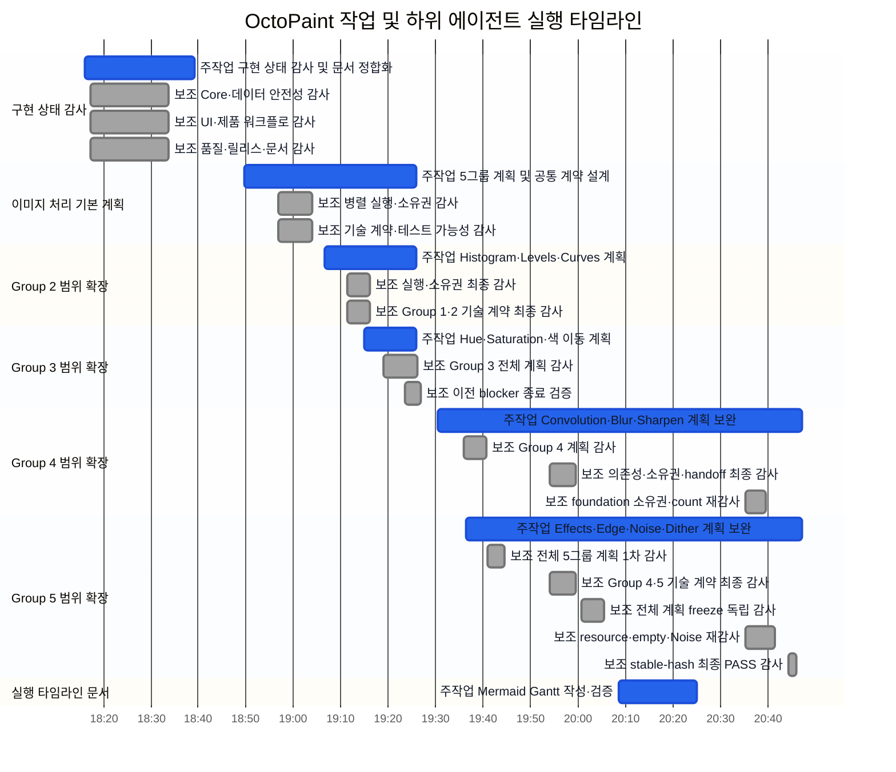
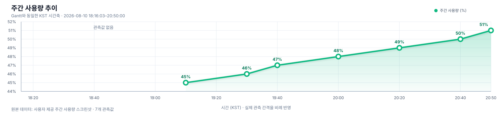

# 작업·하위 에이전트 실행 타임라인

기준 시간대: **KST (UTC+09:00)**
스냅샷 시각: **2026-08-10 20:47:09 KST**

아래 Gantt는 저장소 작업 기록과 Hermes 하위 에이전트 live transcript의 실제 시각을 사용한다.

- **주작업:** 채도가 있는 파란색 막대
- **보조작업:** 흐릿한 무채색 막대
- Group 4·5 계획 보완은 최종 stable-hash 감사와 완료 metadata 반영까지 표시한다.
- 아직 시작하지 않은 foundation 및 Wave 1~5 구현은 실제 시작·종료 시각이 없으므로 차트에서 제외한다.
- Mermaid Gantt에는 진짜 계층형 task가 없어, 작업별 `section` 안에서 `주작업`과 `보조` 접두어로 부모·하위 관계를 표현한다.

## 주간 사용량 선그래프

Gantt와 같은 KST 시간축을 사용하고, 마지막 사용량 관측값을 포함하도록 공통 표시 범위를 **2026-08-10 18:16:03–20:50:00**으로 잡았다. 10분·20분으로 다른 실제 관측 간격은 선그래프의 가로 위치에 비례 반영했다.

| 관측 시각 (KST) | 주간 사용량 |
|---|---:|
| 19:10 | 45% |
| 19:30 | 46% |
| 19:40 | 47% |
| 20:00 | 48% |
| 20:20 | 49% |
| 20:40 | 50% |
| 20:50 | 51% |

## 원시 시각 기록

| 상위 작업 | 유형 | 실행 단위 | 시작 | 종료 | 상태 |
|---|---|---|---|---|---|
| 구현 상태 감사 | 주작업 | 구현 상태 감사·후속 문서 반영 | 18:16:03 | 18:39:17 | 완료 |
| 구현 상태 감사 | 보조 | `deleg_d05bf591/task-0` Core·데이터 | 18:17:08 | 18:33:35 | 완료 |
| 구현 상태 감사 | 보조 | `deleg_d05bf591/task-1` UI·워크플로 | 18:17:08 | 18:33:35 | 완료 |
| 구현 상태 감사 | 보조 | `deleg_d05bf591/task-2` 품질·릴리스·문서 | 18:17:08 | 18:33:35 | 완료 |
| 이미지 처리 기본 계획 | 주작업 | 5그룹 계획·공통 계약 | 18:49:41 | 19:25:47 | 완료 |
| 이미지 처리 기본 계획 | 보조 | `deleg_61580c1e/task-0` 소유권 감사 | 18:56:45 | 19:04:03 | 완료 |
| 이미지 처리 기본 계획 | 보조 | `deleg_61580c1e/task-1` 기술 계약 감사 | 18:56:45 | 19:04:03 | 완료 |
| Group 2 | 주작업 | Group 2 실행 범위 확장 | 19:06:32 | 19:25:47 | 완료 |
| Group 2 | 보조 | `deleg_b67d820e/task-0` 실행 감사 | 19:11:24 | 19:16:13 | 완료 |
| Group 2 | 보조 | `deleg_b67d820e/task-1` 기술 감사 | 19:11:24 | 19:16:13 | 완료 |
| Group 3 | 주작업 | Group 3 실행 범위 확장 | 19:15:02 | 19:25:47 | 완료 |
| Group 3 | 보조 | `deleg_47e9f726/task-0` Group 3 감사 | 19:19:05 | 19:26:07 | 완료 |
| Group 3 | 보조 | `deleg_db1541fc/task-0` blocker 종료 검증 | 19:23:35 | 19:26:52 | 완료 |
| Group 4 | 주작업 | Group 4 실행 범위 추가 | 19:30:25 | 20:47:09 | 완료 |
| Group 4 | 보조 | `deleg_af452873/task-0` Group 4 감사 | 19:35:58 | 19:40:37 | 완료 |
| Group 4 | 보조 | `deleg_0f906856/task-0` 의존성·소유권 감사 | 19:53:59 | 19:59:34 | 완료 |
| Group 4 | 보조 | `deleg_93d407a5/task-1` foundation 소유권·count 재감사 | 20:35:18 | 20:39:27 | 완료 |
| Group 5 | 주작업 | Group 5 실행 범위 추가 | 19:36:21 | 20:47:09 | 완료 |
| Group 5 | 보조 | `deleg_83bae0aa/task-0` 전체 5그룹 1차 감사 | 19:40:50 | 19:44:23 | 완료 |
| Group 5 | 보조 | `deleg_0f906856/task-1` Group 4·5 기술 감사 | 19:53:59 | 19:59:34 | 완료 |
| Group 5 | 보조 | `deleg_1ab35171/task-0` 전체 freeze 감사 | 20:00:34 | 20:05:28 | 완료 |
| Group 5 | 보조 | `deleg_93d407a5/task-0` resource·empty·Noise 재감사 | 20:35:18 | 20:41:32 | 완료 |
| Group 5 | 보조 | `deleg_5ebec1b8/task-0` stable-hash 최종 PASS 감사 | 20:44:22 | 20:45:53 | 완료 |
| 타임라인 문서 | 주작업 | Mermaid Gantt 작성·검증 | 20:08:26 | 20:24:55 | 완료 |

## 시각 출처

- 주작업 완료 시각: `REQUESTS.md`의 요청 기록 및 후속 반영 시각
- Group 4·5 시작 시각과 이 문서 요청 시작 시각: Discord 원문 메시지 timestamp
- 보조작업 시각: `/home/beelink/.hermes/cache/delegation/live/<delegation>/task-<n>.log`의 `started`와 `final` event
- Group 4·5 주작업 종료점은 최종 감사 PASS와 완료 metadata 반영 시각이다.
